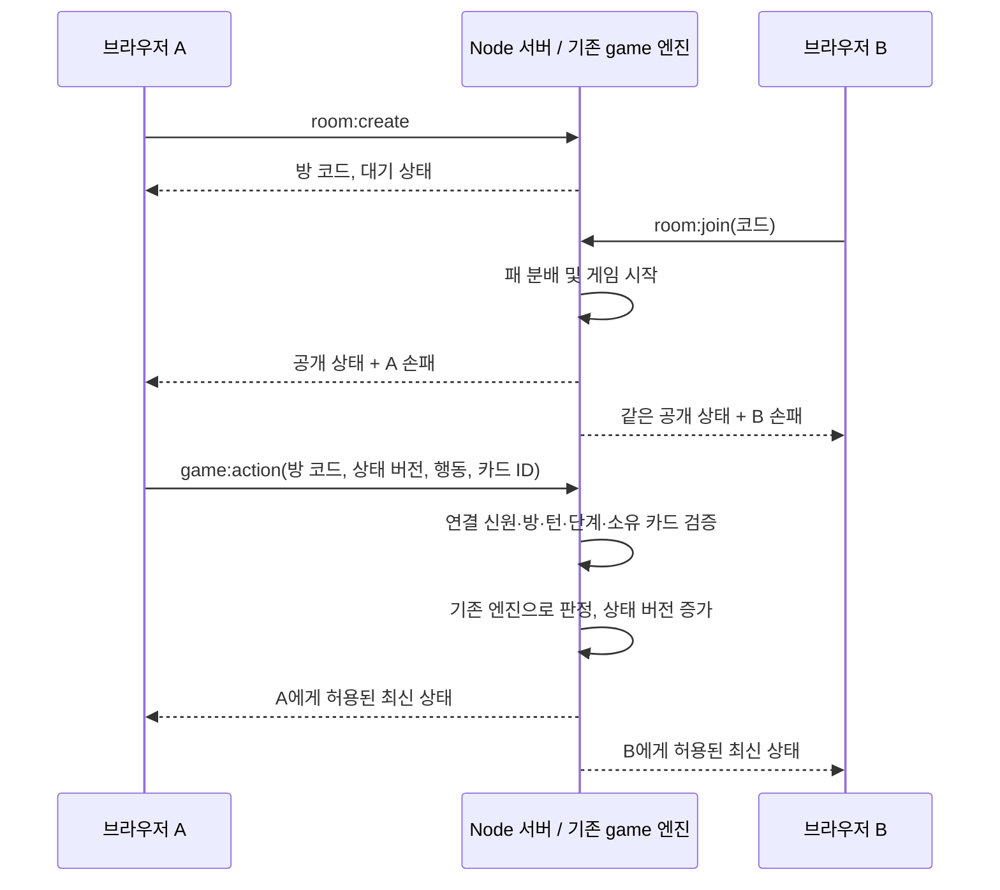

# 온라인 맞고 1차 버전

## 기존 구조 분석과 변경 범위

- `src/MatgoGame.tsx`는 React 상태/ref에 양쪽 손패와 더미를 보관하며 패 분배, 사용자 행동, AI, 턴 진행, GO/STOP, 정산과 애니메이션을 함께 관리합니다. 이 화면을 그대로 온라인 클라이언트로 사용하면 상대 손패가 노출되고 클라이언트가 결과를 결정하게 됩니다.
- `src/game/turn.ts`, `deal.ts`, `scoring.ts`, `settlement.ts`는 React/DOM 의존성이 없는 함수입니다. 온라인 서버가 이 엔진을 직접 import합니다. 카드 데이터와 타입도 재사용합니다.
- `src/App.tsx`에 온라인 진입점만 추가하고, 기존 `MatgoGame.tsx` / `GostopGame.tsx` 및 규칙 엔진은 이번 온라인 작업에서 수정하지 않았습니다.

## 구조

```text
server/
  index.ts              서버 실행, 포트 및 종료 처리
  app.ts                Express, Socket.IO, 방과 연결 관리
  game.ts               서버 전용 전체 상태, 턴 진행 및 액션 검증
  tsconfig.json         서버·공유 타입·서버 테스트 typecheck
  tests/
    game.test.ts        상태 전이, 비공개 정보, 패 선택, 점수·정산
    socket.test.ts      실제 Socket.IO 연결을 통한 통합 테스트
shared/
  online.ts             행동 메시지, 응답, 공개 상태 타입
src/online/
  OnlineMatgo.tsx        방 생성/참가, 서버 상태 표시, 행동 전송
  online.css            온라인 화면과 모드 선택 진입점 스타일
```

Node.js + TypeScript + Express 5 + Socket.IO 4를 사용합니다. 현재 Node 24에서 검증하며, 저장소 루트의 `package.json`/잠금 파일 하나로 프론트엔드와 서버 의존성을 관리합니다. 개발 실행은 `tsx`, 서버 빌드는 TypeScript 검사 후 esbuild 번들을 사용합니다.



## 서버 권한과 비공개 정보

- 메모리에 방별 상태를 보관합니다. 방 코드는 서버가 생성하는 영문·숫자 6자리입니다. 생성자가 0번/선, 참가자가 1번이며 두 번째 사람이 참가하면 시작합니다.
- 신원은 서버가 Socket.IO 연결 ID에 연결한 방 멤버십으로 결정합니다. 클라이언트는 플레이어 번호, 점수, 결과, 전체 패를 보낼 수 없습니다.
- 입력 타입 외에도 런타임에서 허용 필드, 행동, 방 코드, 정수 버전, 카드 ID를 확인합니다. 자신이 가진 카드인지, 자기 턴인지, 현재 단계에서 가능한 행동인지도 검증합니다.
- `revision`이 지난 요청은 거부합니다. 중복 클릭이나 지연된 요청은 같은 턴을 두 번 처리하지 않습니다. 서버 처리에는 중간 `await`가 없고, 복사본 검증 성공 후에만 상태를 교체합니다.
- `gameView`는 전송할 필드만 명시적으로 구성합니다. 자기 손패만 전송하며 상대 손패는 장수로 표시합니다. 더미는 장수만 전송합니다. 공개된 패·먹은 패·점수·턴·결과는 공유합니다.
- 선택 가능한 바닥패 목록은 행동하는 사람에게만 전송합니다. 서버의 `pending` 구조, 전체 손패, 더미 원본을 클라이언트로 보내지 않습니다. 숨겨진 카드를 CSS로 가리는 방식이 아닙니다.
- 상태는 연결별로 전송합니다. 공개/비공개 정보가 섞인 전체 방 상태를 broadcast하지 않습니다. 프론트엔드의 공유 타입 import는 타입 전용이며 서버 코드를 클라이언트 번들에 넣지 않습니다.

## 이벤트

| 방향 | 이벤트 | 역할 |
| --- | --- | --- |
| 클라이언트 → 서버 | `room:create` | 대기 방 생성 |
| 클라이언트 → 서버 | `room:join` | 방 코드로 참가, 2명 초과 거부 |
| 클라이언트 → 서버 | `room:leave` | 방 종료 및 참가자 정리 |
| 클라이언트 → 서버 | `room:sync` | 현재 방의 상태 재전송 |
| 클라이언트 → 서버 | `game:action` | `play`, `choose`, `go`, `stop` |
| 서버 → 클라이언트 | `room:state` | 해당 연결에 허용된 최신 전체 화면 상태 |
| 서버 → 클라이언트 | `room:closed` | 퇴장/연결 종료 알림 |

요청은 성공/오류 acknowledgement를 사용합니다. 클라이언트는 연결 중에만 행동을 보내며 응답 대기 중 중복 입력을 막습니다. 응답 시간 초과 시 자동 재시도하지 않고 상태 새로고침을 안내합니다.

Socket.IO 타입이 런타임 검증을 대체하지 않는다는 점과 메시지 전달 보장은 [공식 TypeScript 문서](https://socket.io/docs/v4/typescript/), [공식 전달 보장 문서](https://socket.io/docs/v4/delivery-guarantees/)를 참고했습니다. Express 구성은 [공식 설치 가이드](https://expressjs.com/en/5x/starter/installing/)를 참고했습니다.

## 현재 지원 범위

- 방 생성, 코드 참가, 두 명의 자동 게임 시작, 손패 비공개, 양방향 턴 동기화.
- 일반 카드 내기, 손패/더미 매칭 선택, 뻑·쪽·따닥·뻑 회수·판쓸 판정 및 피 이동, 점수 계산, GO/STOP, 2인 정산, 나가리.
- 기존 판쓸 하우스 룰을 서버에서도 같은 함수로 적용합니다. 새로운 게임 규칙은 추가하지 않습니다.
- 온라인 폭탄·흔들기·폭탄 패스 선택과 기존 상세 이동/뒤집기 애니메이션은 후속 범위입니다. 온라인 화면은 서버가 확정한 상태와 이번 턴 공개 패를 표시합니다. 기존 AI 모드에서는 이 기능들이 그대로 유지됩니다.
- 로그인, DB, 배포, Redis, 재접속 복구, 관전, 자동 재대결은 포함하지 않습니다. 인메모리 상태는 서버 재시작 시 사라집니다.
- 한 명이 나가거나 연결 종료가 감지되면 방을 삭제하고 상대에게 알립니다. 브라우저 새로고침 후에는 새 방을 만들어야 합니다. 재연결된 소켓이 이전 플레이어 권한을 자동으로 받지 않습니다.

## 두 브라우저에서 실행

저장소 루트에서 의존성을 설치한 뒤 터미널 두 개를 사용합니다.

```sh
npm install
```

터미널 1:

```sh
npm run dev:server
```

터미널 2:

```sh
npm run dev
```

1. 두 브라우저(또는 독립된 두 탭)에서 Vite가 출력한 주소(보통 `http://localhost:5173`)를 엽니다.
2. 첫 화면에서 각각 **온라인 2인 맞고**를 선택합니다.
3. A에서 **방 만들기**, B에서 표시된 6자리 코드 입력 후 **참가하기**를 누릅니다.
4. A가 선입니다. 패를 내고, 선택 안내가 뜨면 바닥패를 고릅니다. 양쪽의 바닥패·점수·상태 번호가 같고 자기 손패만 보이는지 확인합니다.
5. B 차례에는 B에서 패를 냅니다. 7점 이상으로 점수가 증가하면 해당 플레이어가 GO/STOP을 선택합니다.
6. 종료 후 방을 나가 새 방을 만들 수 있습니다. 기존 AI 모드는 **게임 선택**으로 돌아가 이용합니다.

Socket.IO는 Vite의 `/socket.io` 프록시를 통해 로컬 서버 `127.0.0.1:3001`로 연결됩니다. 기본 서버는 루프백에만 바인딩합니다. 서버 `PORT`를 바꾸면 `vite.config.ts`의 프록시 대상도 맞춰야 합니다. 두 컴퓨터를 같은 LAN에서 시험하려면 프론트엔드를 `npm run dev -- --host 0.0.0.0`으로 실행하고 두 브라우저에서 해당 컴퓨터의 LAN 주소로 접속합니다.

```sh
npm run typecheck
npm run test:online
node --test tests/pansseul.test.mjs
npm run build
```

`npm run build`는 기존 Vite 프론트엔드와 서버를 모두 빌드합니다. 서버 산출물은 `dist/server/index.mjs`이며 `npm run start:server`로 실행할 수 있습니다. 프론트엔드를 배포하는 서버는 이번 범위에 포함하지 않습니다. 개발 시에는 위 Vite 실행 절차를 사용합니다.
